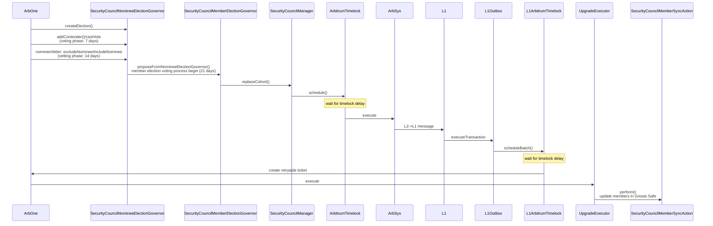

> [Arbitrum Security Council Election System Findings & Analysis Report](https://code4rena.com/reports/2023-08-arbitrum)

## Overview

- **Security Council election** is a process by which the Arbitrum DAO can elect the members of Security Council
- **Security Council** is divided into 2 cohorts, each of which contains 6 members and is elected alternately every 6 months



## Governor Signature Replay

Affected versions | Fixed
-|-
<= 4.9.3 | [Add Governor signature nonces by ernestognw · Pull Request #4378](https://github.com/OpenZeppelin/openzeppelin-contracts/pull/4378)

- The `castVoteWithReasonAndParamsBySig()` and `castVoteBySig()` functions do not track the signature's nonce

    ```js
    function castVoteBySig(
        ...
    ) public virtual override returns (uint256) {
        address voter = ECDSA.recover(
            _hashTypedDataV4(keccak256(abi.encode(BALLOT_TYPEHASH, proposalId, support))),
            v,
            r,
            s
        );
        return _castVote(proposalId, voter, support, "");
    }

    function castVoteWithReasonAndParamsBySig(
        ...
    ) public virtual override returns (uint256) {
        address voter = ECDSA.recover(
            _hashTypedDataV4(
                keccak256(
                    abi.encode(
                        EXTENDED_BALLOT_TYPEHASH,
                        proposalId,
                        support,
                        keccak256(bytes(reason)),
                        keccak256(params)
                    )
                )
            ),
            v,
            r,
            s
        );

        return _castVote(proposalId, voter, support, reason, params);
    }
    ```

- The replaying of the signature would result in consuming more of the user's voting weight, while keeping the proportion of the `Against`, `For` and `Abstain` votes the same

## Settings Can Be Changed During an Active Election

> This makes the voting unfair and the results unreliable as the owner can control the voting power during the election.

```js
function setFullWeightDuration(uint256 newFullWeightDuration) public onlyGovernance {
    if (newFullWeightDuration > votingPeriod()) {
        revert FullWeightDurationGreaterThanVotingPeriod(newFullWeightDuration, votingPeriod());
    }

    fullWeightDuration = newFullWeightDuration;
    emit FullWeightDurationSet(newFullWeightDuration);
}


/// @notice The deadline after which voting weight will linearly decrease
/// @param proposalId The proposal to check the deadline for
function fullWeightVotingDeadline(uint256 proposalId) public view returns (uint256) {
    uint256 startBlock = proposalSnapshot(proposalId);
    return startBlock + fullWeightDuration;
}

function votesToWeight(uint256 proposalId, uint256 blockNumber, uint256 votes)
    public
    view
    returns (uint240)
{
    ...
    // Between proposalSnapshot and fullWeightVotingDeadline all votes will have 100% weight - each vote has weight 1
    uint256 fullWeightVotingDeadline_ = fullWeightVotingDeadline(proposalId);
    if (blockNumber <= fullWeightVotingDeadline_) {
        return _downCast(votes);
    }
    ...
}
```

Since it's a privileged function, fix is just add comments informing the caller not to set during certain times.

## Carelessness in Conversion from Datetime to Timestamp

- Security council election can be created every 6 months
- The code uses `firstNominationStartDate.day` to form the result day, which could result in wrong calculation since the day of the month can vary between 28-31
    - `dateTimeToTimestamp()` doesn't check if the date time is valid. `DateTimeLib` provides `isSupportedDateTime()` function to check
- For example, if `firstNominationStartDate` is `2024-08-31T01:00`. It's expected to create election again 6 months from that, i.e. `2025-02-28T01:00`. But in fact, the result of `electionToTimestamp()` will be `2025-03-03T01:00`, which is 4 days away from the expected date

```js
function createElection() external returns (uint256 proposalId) {
    ...
    // each election has a deterministic start time
    uint256 thisElectionStartTs = electionToTimestamp(electionCount);
    if (block.timestamp < thisElectionStartTs) {
        revert CreateTooEarly(block.timestamp, thisElectionStartTs);
    }
    ...
}

function electionToTimestamp(uint256 electionIndex) public view returns (uint256) {
    // subtract one to make month 0 indexed
    uint256 month = firstNominationStartDate.month - 1;

    month += 6 * electionIndex;
    uint256 year = firstNominationStartDate.year + month / 12;
    month = month % 12;

    // add one to make month 1 indexed
    month += 1;

    return DateTimeLib.dateTimeToTimestamp({
        year: year,
        month: month,
        day: firstNominationStartDate.day,
        hour: firstNominationStartDate.hour,
        minute: 0,
        second: 0
    });
}
```

## Incorrect Initialization of Upgradeable Contract

- The `SecurityCouncilMemberRemovalGovernor` contract inherits `GovernorUpgradeable` and `EIP712Upgradeable` contracts but does not invoke their individual initializers during its own initialization

    ```js
    contract SecurityCouncilMemberRemovalGovernor is
        Initializable,
        GovernorUpgradeable,
        GovernorVotesUpgradeable,
        GovernorPreventLateQuorumUpgradeable,
        GovernorCountingSimpleUpgradeable,
        ArbitrumGovernorVotesQuorumFractionUpgradeable,
        GovernorSettingsUpgradeable,
        ArbitrumGovernorProposalExpirationUpgradeable,
        OwnableUpgradeable
    {
        ...
        function initialize(
            ...
        ) public initializer {
            __GovernorSettings_init(_votingDelay, _votingPeriod, _proposalThreshold);
            __GovernorCountingSimple_init();
            __GovernorVotes_init(_token);
            __ArbitrumGovernorVotesQuorumFraction_init(_quorumNumerator);
            __GovernorPreventLateQuorum_init(_minPeriodAfterQuorum);
            __ArbitrumGovernorProposalExpirationUpgradeable_init(_proposalExpirationBlocks);
            _transferOwnership(_owner);

            ...
        }
    }
    ```

- In `GovernorUpgradeable` the `_name` storage variable is never initialized and the `name()` function returns an empty string
- In `EIP712Upgradeable`, `_HASHED_NAME` and `_HASHED_VERSION` are used in the `castVoteBySig()` and `castVoteWithReasonAndParamsBySig()` functions of `SecurityCouncilMemberRemovalGovernor`

```js
function __Governor_init(string memory name_) internal onlyInitializing {
    __EIP712_init_unchained(name_, version());
    __Governor_init_unchained(name_);
}

function __Governor_init_unchained(string memory name_) internal onlyInitializing {
    _name = name_;
}

function __EIP712_init_unchained(string memory name, string memory version) internal onlyInitializing {
    bytes32 hashedName = keccak256(bytes(name));
    bytes32 hashedVersion = keccak256(bytes(version));
    _HASHED_NAME = hashedName;
    _HASHED_VERSION = hashedVersion;
}
```

- Although this issue has been included in [automated findings report](https://gist.github.com/code423n4/3173e8e05a4e7fe6f28afbb02358b820#l03-upgradeable-contract-not-initialized), the report doesn't explain the full impact and incorrectly judges it as low
- The C4 docs explicitly states that raising issues from bot reports to a higher severity is fair

## Low Risk and Non-Critical Issues

- **Fixed** Insufficient cohorts verification during initialization
    - The `firstCohort` and `secondCohort` could be of any size; one member could end up in both cohorts; duplicates in both cohorts

    ```js
    if (_firstCohort.length != _secondCohort.length) {  // only ensure they are the same length
        revert CohortLengthMismatch(_firstCohort, _secondCohort);
    }
    firstCohort = _firstCohort;
    secondCohort = _secondCohort;
    ```

- **Fixed** The `areAddressArraysEqual()` function checks if each element in `array1` exists in `array2` to determine whether these 2 arrays are equal
    - If both `array1` and `array2` contain duplicate elements, they are not equal, e.g. `[1, 1, 2]` and `[1, 2, 2]`
- **Fixed** `generateSalt()` may produce the same salt, leading to collisions (Doesn't seem to have any actual impact though :<)

    ```diff
    function generateSalt(address[] memory _members, uint256 nonce)
        external
        pure
        returns (bytes32)
    {
    -    return keccak256(abi.encodePacked(_members, nonce));
    +    return keccak256(abi.encode(_members, nonce));
    }
    ```

- **Resolved** `selectTopNominees()` simply picks the first 6 nominees after `LibSort.insertionSort()` is called, consider documenting how voting ties are handled to prevent confusion
- **Acknowledged** Governor contracts should prevent users from directly transferring ETH or tokens
    - Openzeppelin's `GovernorUpgradeable` contract contains functions that allow inheriting contracts to receive ETH and tokens. Funds may be stuck in the contract until rescued by governance
- **Acknowledged** Check that `_addressToRemove` and `_addressToAdd` are not equal in `_swapMembers()`

    ```diff
    function _swapMembers(address _addressToRemove, address _addressToAdd)
        internal
        returns (Cohort)
    {
        if (_addressToRemove == address(0) || _addressToAdd == address(0)) {
            revert ZeroAddress();
        }
    +   if (_addressToRemove == _addressToAdd) {
    +       revert CannotSwapSameMembers();
    +   }    
        Cohort cohort = _removeMemberFromCohortArray(_addressToRemove);
        _addMemberToCohortArray(_addressToAdd, cohort);
        _scheduleUpdate();
        return cohort;
    }
    ```

- **Acknowledged** The `relay()` function, which makes calls with `AddressUpgradeable.functionCallWithValue()`, it's not declared as `payable`
    - It's possible send in funds via `receive()` as a workaround

## References

- [Signature Can Be Replayed for Fractional Voting](https://blog.openzeppelin.com/scopelift-flexible-voting-audit#signature-can-be-replayed-for-fractional-voting)
- [Automated findings considered known issues](https://docs.code4rena.com/roles/wardens/submission-policy#automated-findings-considered-known-issues)