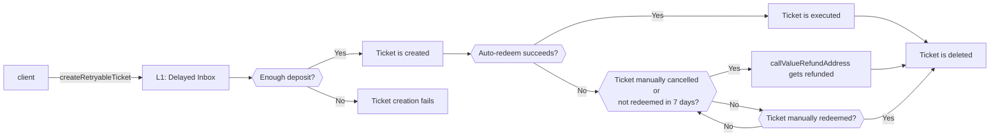

## The Lifecycle of an Arbitrum Transaction

### 1. Sequencer receives transaction

1. For typical transacting within the L2 environment, a signed transaction can be directly delivered
2. A client can also send a message to the Sequencer by signing and publishing an _L1 transaction_ in the Arbitrum chain's **Delayed Inbox** (commonly used for depositing ETH or tokens via a bridge)

### 2. Sequencer orders transaction and posts in a batch

Upon receiving a transaction, the Sequencer will order it in its off-chain Inbox, locally execute it using the AVM and give a transaction receipt to the client.

Under normal conditions, the sequencer will post a batch of L2 transactions onto the underlying L1 every few minutes.

After a client's transaction is posted in a batch, the client can treat him/her transaction's finality as equivalent to an ordinary Ethereum transaction if there is at least one well-behaved active Arbitrum validator.

### 3. Validator asserts RBlock that includes transaction

A staked, active validator will then run the AVM over the inputs in the Inbox (over transactions posted on L1) and make an on-chain assertion about the chain's latest state, i.e. a rollup block or RBlock.

In the common case, the validator asserted a valid RBlock, and over the course of the dispute window no other validators challenge it.

### 4. RBlock is confirmed on L1

Once any and all disputes have been resolved and sufficient time has passed, RBlock can be confirmed on L1 and the Outbox root on L1 gets updated.

It's only after confirmation that L2-to-L1 messages can be executed on L1.

## Cross-Chain Messaging

### L1-to-L2 Messaging

> Retryable tickets are Arbitrum's canonical method for creating L1-to-L2 messages.



- **Retryable Redeem** The execution of a Retryable Ticket on L2, can be automatic or manual via a user-initiated L2 transaction
    - If a redeem is not done at submission or the submission's initial redeem fails, the ticket will be temporarily kept in memory for a fixed period
    - If the fixed period elapses without a successful redeem, the ticket expires, unless some party has paid a fee to keep the ticket alive for another full period
- A special message type exists for simple ETH deposits (i.e. sending ETH from L1 to L2). ETH can be deposited via a call to the `Inbox`'s `depositEth` method

### L2-to-L1 Messaging

```mermaid
flowchart LR

client -- 1. sendTxToL1 --> ArbSys[L2: ArbSys precompile contract]
ArbSys -. 2. related assertion is confirmed .-> client
client -- 3. executeTransaction --> Outbox[L1: Outbox]
```

There is no automatic L1 execution for outgoing messages, since Ethereum itself doesn't offer scheduled execution affordances.

## References

- [Overview: The Lifecycle of an Arbitrum Transaction | Arbitrum Docs](https://docs.arbitrum.io/tx-lifecycle)
- [Glossary of Arbitrum Terms | Arbitrum Docs](https://docs.arbitrum.io/intro/glossary)
- [Inside Arbitrum Nitro | Arbitrum Docs](https://docs.arbitrum.io/inside-arbitrum-nitro/#bridging)