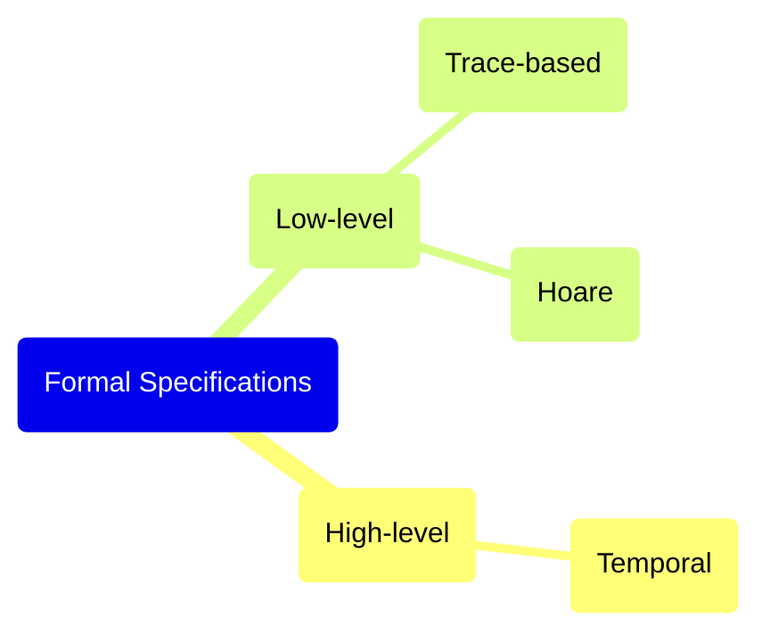

- 形式化验证（Formal Verification）采用形式化方法描述、设计和验证程序，能证明合约的业务逻辑符合预先定义的规范，相比于其它评估合约代码正确性的方法，如测试，更能有力地保障智能合约功能的正确性
- 形式化验证适合规则少的专业化领域
- 通过形式化建模描述系统的预期行为，形式化属性的创建由规范语言提供支持，形式化验证技术可以验证合约的实现是否符合其规范，并提供合约正确性的数学证明
- 形式化模型（Formal Model）指对计算过程的数学描述，将程序抽象成数学函数（方程），描述给定输入时如何计算函数的输出，可以在抽象层次上分析、评估程序行为
    - *高级模型*侧重于智能合约和外部实体（如外部账户、合约账户、区块链环境）间的关系，有助于推理合约功能，但可能无法捕捉到实现的内部运作细节
    - *低级模型*依赖智能合约的低级表示（如程序追踪、控制流程图），采用白盒的方式来推理与智能合约执行相关的属性，体现智能合约在以太坊执行环境中的实际执行，被视为理想模型

## Formal Specification

- 形式化规范指属性（不变量），即对于智能合约必须符合的要求的正式描述
- 形式化规范可认为是使用形式化语言编写的语句集合，描述智能合约的预期执行
- 规范涵盖合约的属性和合约在不同情况下行为的定义，形式化验证的目的是确定智能合约是否具有这些属性（不变量）以及在执行过程中这些属性是否被违反

### 高级规范

- 高级规范（或面向模型的规范）描述程序的高级行为，将智能合约建模成一个有限状态机（Finite-State Machine, FSM），可以通过执行操作在不同的状态之间转换并使用时间逻辑（Temporal Logic）定义有限状态机模型的形式化属性
- 时间逻辑描述智能合约可以进入的未来状态及其如何在不同状态之间转换
- 智能合约关键时间属性
    - **安全性** 用于表示不变性
    - **活性** 涉及合约在不同状态间转换的能力

### 低级规范

- 低级规范（或面向属性的规范）描述通过建模抽象、由数学函数集合而成系统的正确行为
- 低级规范分析程序轨迹并尝试根据轨迹定义智能合约的属性，有助于规定合约内部执行的要求

#### 霍尔属性 Hoare-Style Properties

- 霍尔属性使用霍尔三元组 `{P}c{Q}` 表示
    - `c` 程序，`P` 前置条件，`Q` 后置条件
- 前置条件描述函数正确执行所需条件，后置条件描述函数正确执行应达成的条件
- 使用霍尔逻辑制定智能合约规范需要为合约中函数和循环的执行定义前置条件、后置条件和不变量

#### 执行轨迹级属性 Trace-Level Properties

- 执行轨迹即以特定方式改变合约状态的一系列操作，基于执行轨迹的规范描述改变合约状态的操作及其间关系
- 执行轨迹规范主要用于推理智能合约中内部执行的模式。使用符号执行等技术，可以形式化验证执行只遵循已在形式化模型中定义的路径

## Techniques for Formal Verification of Smart Contracts

### 模型检查 Model checking

- 使用一种算法根据规范检查智能合约的形式化模型
- 智能合约通常表示为状态转换系统，而允许的合约状态的属性使用时间逻辑定义
- 主要用于评估描述智能合约在一段时间内行为的时间属性
- 使用状态空间探索，其中涉及构造智能合约所有可能的状态以及尝试找到导致违反属性的可达状态，这可能导致无限多个状态，因此模型检查器依靠抽象技术来实现智能合约的高效分析

### 定理证明 Theorem Proving

- 定理证明涉及将合约系统的模型及其规范转换成数学公式（逻辑语句），目的是验证这些语句间的逻辑等价性
- 定理证明可处理对无限状态系统的分析，但不可能总是知道一个逻辑问题的可判定性，需借助人力来引导定理证明器推导出正确性证明，成本高于能够自动化的模型检查

### 符号执行 Symbolic Execution

- 符号执行是一种通过使用符号值执行函数来分析智能合约的方法，用于形式化推理合约代码中执行轨迹级属性
- 符号执行依赖于程序的输入，而探索所有可达状态的输入集可能是无限的，因此符号执行仍是一种测试形式，但在寻找触发违反属性的输入方面比常规测试更高效

## References

- [Formal verification of smart contracts | ethereum.org](https://ethereum.org/en/developers/docs/smart-contracts/formal-verification/)