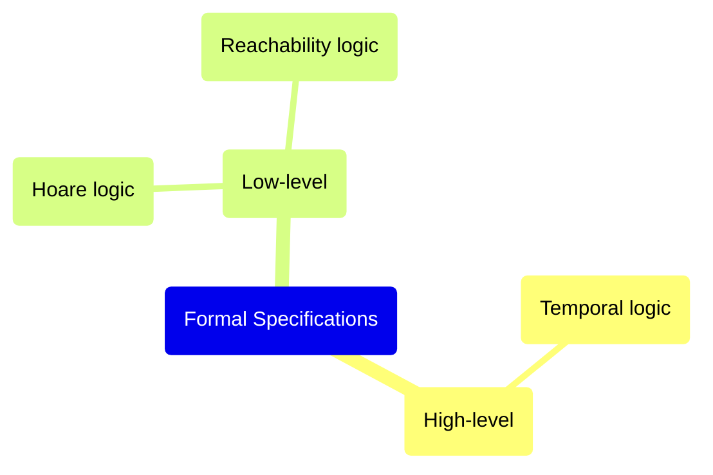

- 形式化验证（Formal Verification）采用形式化方法描述、设计和验证程序，能证明合约的业务逻辑符合预先定义的规范，相比于其它评估合约代码正确性的方法，如测试，更能有力地保障智能合约功能的正确性
- 通过形式化建模描述系统的预期行为，形式化属性的创建由规范语言提供支持，形式化验证技术可以验证合约的实现是否符合其规范，并提供合约正确性的数学证明

## Types of Formal Specifications for Smart Contracts

## References

- [Formal verification of smart contracts | ethereum.org](https://ethereum.org/en/developers/docs/smart-contracts/formal-verification/)