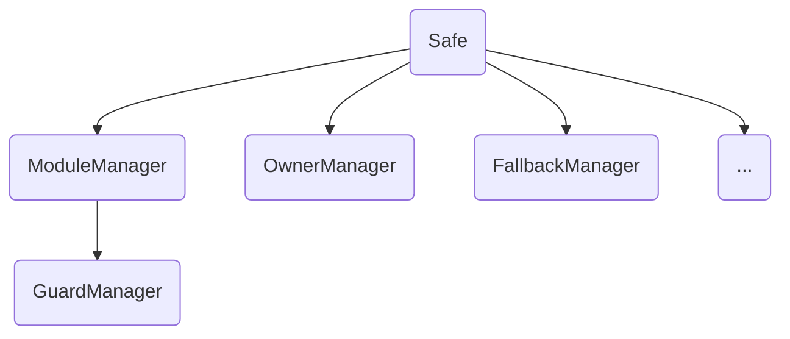

## Terms

- **Threshold** Number of required confirmations for a Safe transaction
- **Owners** List of addresses that control the Safe, managed in `OwnerManager`
- **Guard** A contract that can execute pre- and post- transaction checks, managed in `GuardManager`
- **Modules** Contracts that can be used to extend the write functionality of a Safe, managed in `ModuleManager`
- **Fallback** A contract that can provide additional read-only functional for Safe, managed in `FallbackManager`



## Safe

> Contains the main logic of the protocol.

- `constructor()` Disabled the logic contract by setting the `threshold` to 1 with 0 owners
- `setup()` The initialization function, which can only be called once (protected by `threshold`, which can only be 0 at initialization)
    - `OwnerManager.setupOwners()`
    - If fallbackHandler is not `address(0)`, `internalSetFallbackHandler()`
    - `ModuleManager.setupModules()`
    - If payment is not 0, `handlePayment()`
- `execTransaction()` Verifies the signature and executes a transaction. If the guard is set, it'll check before and after executing the transaction

    ```solidity
    function execTransaction(
        address to,
        uint256 value,
        bytes calldata data,
        Enum.Operation operation,
        uint256 safeTxGas,
        uint256 baseGas,
        uint256 gasPrice,
        address gasToken,
        address payable refundReceiver,
        bytes memory signatures
    ) public payable virtual returns (bool success)
    ```

## OwnerManager

Functions are protected by `authorized` modifier, which allows only the Safe contract itself to call the functions.

- `addOwnerWithThreshold()` Adds the owner and updates the threshold
- `removeOwner()` Removes the owner and updates the threshold
- `swapOwner()`
- `changeThreshold()`

## ModuleManager

- Functions that are protected by `authorized` modifier
    - `enableModule()`
    - `disableModule()`
- `execTransactionFromModule()` Only whitelisted modules are allowed, returns `(bool success)`
- `execTransactionFromModuleReturnData()`, returns `(bool success, bytes memory returnData)`

## References

- [safe-contracts/docs/Safe_Audit_Report_1_4_0.pdf at main · safe-global/safe-contracts](https://github.com/safe-global/safe-contracts/blob/main/docs/Safe_Audit_Report_1_4_0.pdf)
- [Gnosis Multisig Safe - HackMD](https://hackmd.io/@kyzooghost/HJMi2Nllq?print-pdf#/)