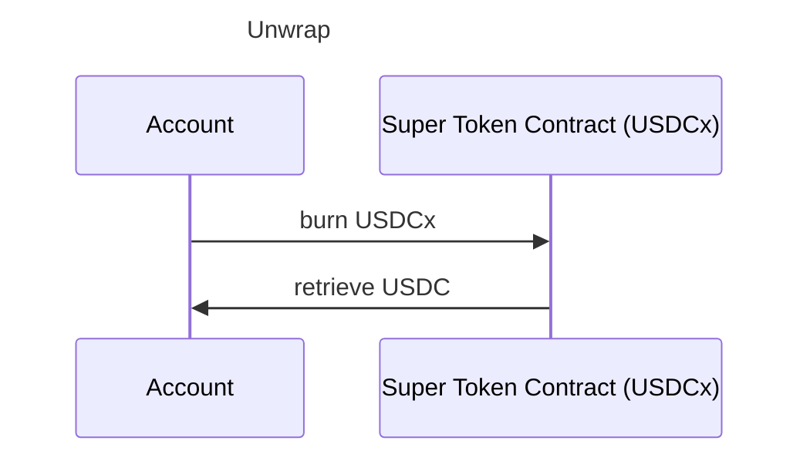
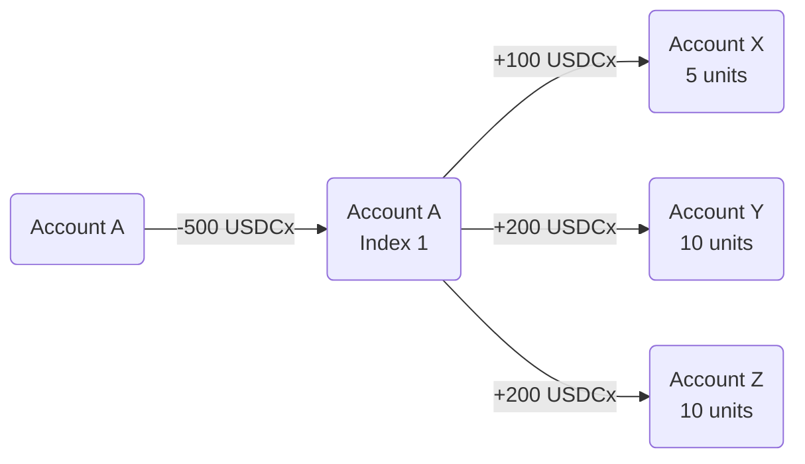
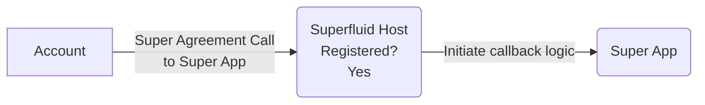
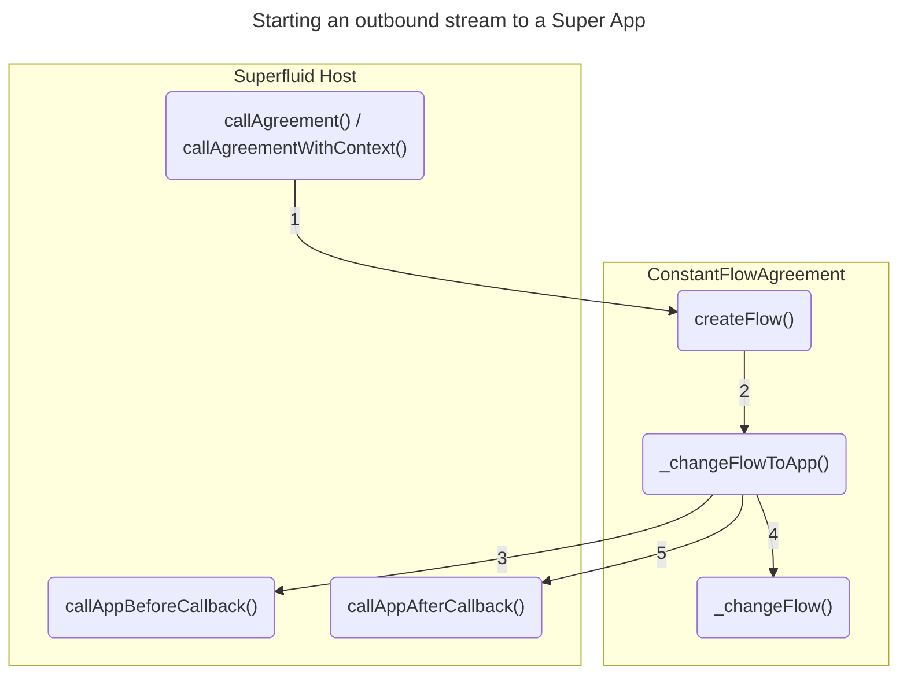

## Overview

- The Superfluid Protocol is an EVM-based smart contract framework that allows for **streaming** crypto payments
- It takes a single on-chain transaction, and money will flow to the receiver(s) in real time without recurring gas fees

### Use Cases

- Payments for salaries, subscriptions and rentals can be automated to constantly stream, e.g. employees get paid by the second instead of monthly
- Rewards and royalties can be distributed to multiple recipients in a single transaction with a fixed gas cost

## Components

### Superfluid Host

The Superfluid Host connects **Super Tokens**, **Super Agreements** and **Super Apps**.

### Super Tokens

> The base of the Superfluid Protocol, an _extension_ of the ERC20 token standard

```
Current Balance = Real-Time Balances + Static Balance
```

- **Static Balance** equivalent to the usual ERC20 token balance
- **Real-Time Balances** the individual impact (positive / negative) that each Super Agreement has on an account's balance (information grabbed through the Host contract)

#### Wrapper

Wrap existing tokens into Super Tokens to gain Super Agreement functionality.




#### Pure / Custom

Pure Super Tokens are deployed directly as Super Tokens with all of the associated Superfluid functionality.

### Super Agreements

> Super Agreements define ways that Super Token balances can be modified beyond the basic ERC20 functions

#### 🚰 Constant Flow Agreement (CFA)

- In a CFA, the sender agrees to have its account balance reduce at a certain per-second rate and the receiver's account balance increase at that flow rate
- A stream is perpetual and will continue until canceled by the sender or sentinel

##### Terminology

- **Netflow Rate** The _per-second_ rate that an account's Super Token's balance is changing
- **Flow Rate** The _per-second_ rate that a sender _decreases_ its netflow and _increases_ a receivers netflow
- **CRUD timestamp** The timestamp of when an account creates, updates, or deletes a CFA

```
Static Balance = Initial Balance at latest CRUD timestamp
Real-Time Balance = Netflow Rate * Seconds elapsed since latest CRUD timestamp
```

##### Solvency and Sentinels

- When an account with a negative netflow rate reaches a zero balance, it's deemed **critical**
- When a stream is opened, a certain amount of Super Tokens are withheld as a **buffer**, which will be refunded if an account cancels outbound streams before going critical
- When an account does go critical, Super Tokens from the buffer are used to continue the account's outbound stream(s) until **Sentinels** step in and cancel them. The remainder of the buffer is rewarded to the Sentinel who closes the stream

#### ✳ Instant Distribution Agreement (IDA)

An account can distribute funds to any number of recipients, at a fixed gas cost, based on pre-determined proportions (units)



##### Terminology

- **IDA Index** A channel made by a publisher account to distribute Super Tokens to any amount of receivers
- **Distribution** Takes the specified amount of Super Tokens from the sender's account and distributes them to all receivers
- **Units** Dictate the proportion of Super Tokens distributed through an index that a subscriber is to receive. They work like distribution _shares_
- **Publisher** / **Subscribers**


#### 🌊 General Distribution Agreement (GDA)

> Enables one-to-many Superfluid streaming distributions

**Concepts mappings**

IDA | GDA
-|-
Index | Pool
Units | Units
Subscriber | Pool Member
Publisher | Pool Admin / Distributor

**Key differences between GDA and IDA**

GDA|IDA
-|-
A pool is an ERC20 token contract. Units are transferable, but only the pool admin can create / delete units | Index data is stored on the SuperToken. Only publisher can modify units
Anyone can distribute funds | Only publisher can distribute

### Super Apps

- Super Apps are registered with the Superfluid Protocol allowing them to react to Super Agreements
- Through **callbacks**, Super Apps can react to the _creating_, _updating_, and _deleting_ of Super Agreements
    - Similar to ERC777 hooks, but for Super Agreements



#### Rules (Jail System)

Super App rules should be obeyed, or contracts risk being **jailed** by the protocol.

- Super Apps can't revert in the **termination** callback (`afterAgreementTerminated()`)
- The super token balance of a super app must stay greater than 0 
- Gas limit operations within the **termination** callback
- Incorrect ctx data within the **termination** callback

## Calling Super Agreements In-Depth



> Note: `createFlow()` can be called directly

### CallAgreement vs CallAgreementWithContext

`callAgreementWithContext()` is designed for use within Super App callbacks, while `callAgreement()` is not.

## References

- [How Superfluid Makes Payments Frictionless](https://www.linumlabs.com/articles/how-superfluid-make-payments-frictionless)
- [Use Cases - Superfluid](https://docs.superfluid.finance/superfluid/protocol-overview/use-cases)
- [In-Depth Overview - Superfluid](https://docs.superfluid.finance/superfluid/protocol-overview/in-depth-overview)
- [Super Apps in Depth - Superfluid](https://docs.superfluid.finance/superfluid/developers/super-apps/super-app)