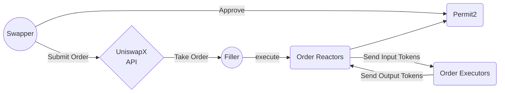
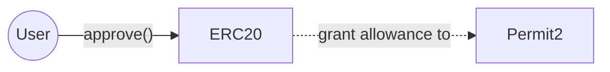
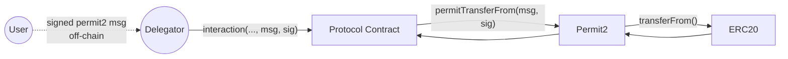

> UniswapX is a new permissionless, open source (GPL), Dutch auction-based[^dutch-auction] protocol for trading across AMMs and other liquidity sources.

## Overview

- Swappers sign a unique _off-chain_ order, which is then submitted _onchain_ to Order Reactors by fillers who pay gas on swappers' behalf
- Permit2 is used to allow the transfer of tokens
- Order Reactors are responsible for validating orders of a specific type, resolving them into inputs and outputs, executing them according to the filler's strategy, and verifying that the order was successfully fulfilled
- The swap inputs and outputs depend on the order signed by swappers. There is no need for swappers to worry about whether they're getting the best price

### Permit2

Before integrating contracts can request users' tokens through Permit2, users must approve the Permit2 contract for the specific token.

## References

- [Introducing the UniswapX Protocol](https://blog.uniswap.org/uniswapx-protocol)
- [How does UniswapX work? – Uniswap Labs](https://support.uniswap.org/hc/en-us/articles/17542712707725-How-does-UniswapX-work-)
- [useful-solidity-patterns/patterns/permit2 at main · dragonfly-xyz/useful-solidity-patterns](https://github.com/dragonfly-xyz/useful-solidity-patterns/tree/main/patterns/permit2)

[^dutch-auction]: A Dutch auction (also called a **descending price** auction) refers to a type of auction in which an auctioneer starts with a very high price, gradually lowering the price until someone places a bid.